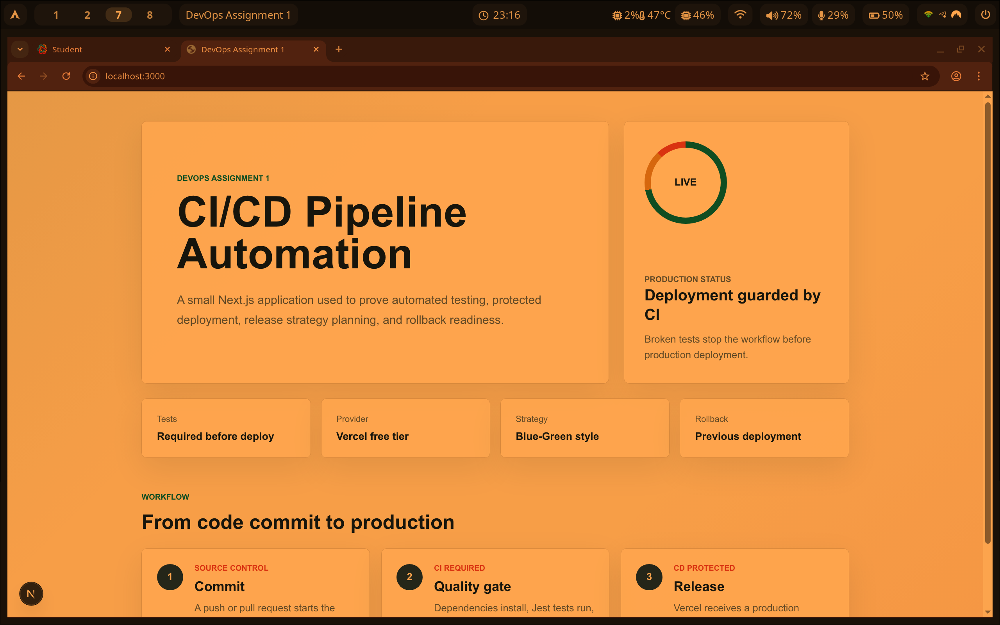
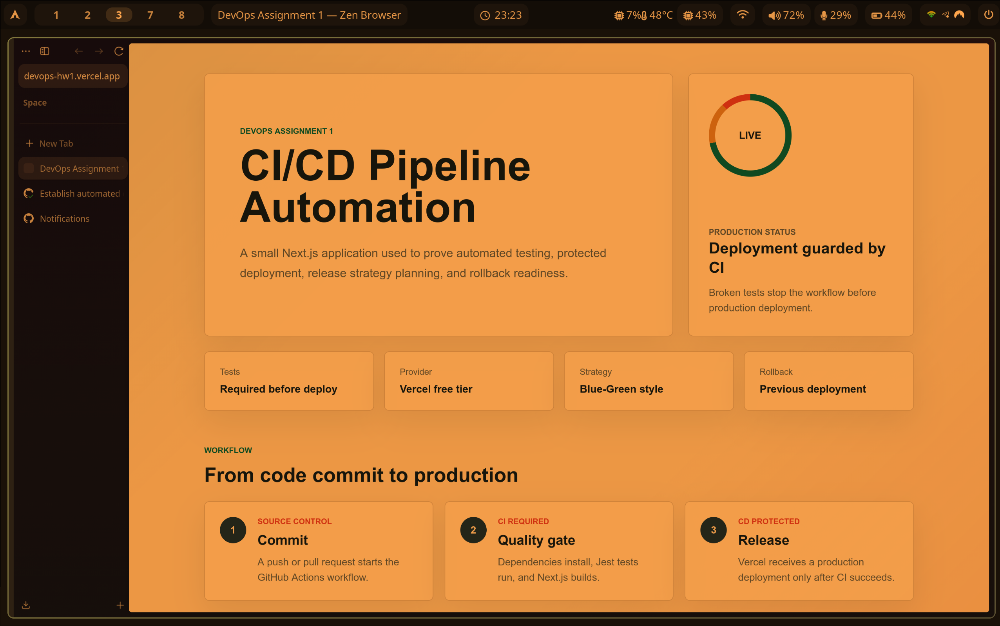
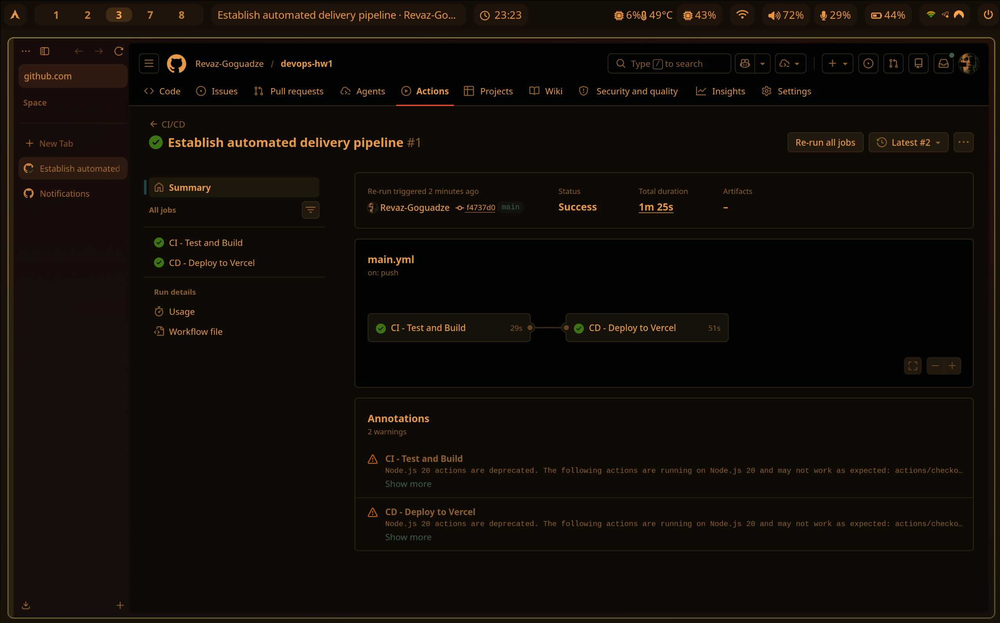
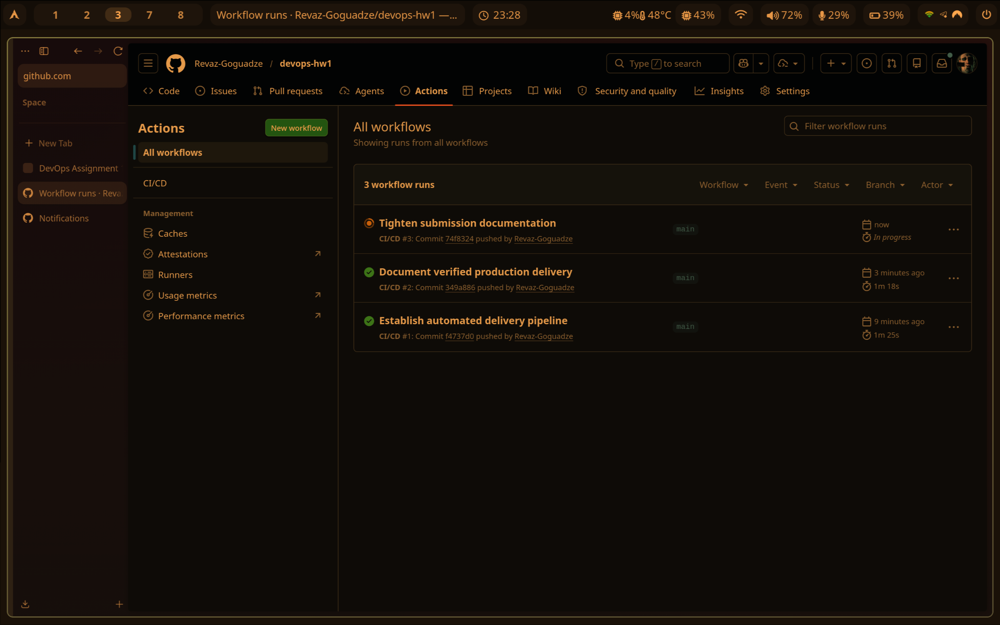

# DevOps Assignment 1 - CI/CD Pipeline Automation

This repository contains a small Next.js application used to demonstrate a complete CI/CD workflow: automated tests, protected deployment, a release strategy, and a rollback protocol.

## Live Application Link

https://devops-hw1.vercel.app

## Screenshots

### Hosted Application



### Vercel Production Deployment



### Successful GitHub Actions Run



### GitHub Actions Run History



## Pipeline Description

The pipeline is defined in `.github/workflows/main.yml` and runs on every push and pull request to `main`.

1. GitHub Actions checks out the repository.
2. Node.js is installed and dependencies are restored with `npm ci`.
3. The Jest test suite runs with `npm test`.
4. ESLint checks the project with `npm run lint`.
5. Next.js creates a production build with `npm run build`.
6. Deployment to Vercel runs only after the CI job succeeds.

The deployment job uses `needs: test`, so a failing test, lint error, or build error stops the workflow before production deployment.

## Deployment Strategy

Chosen strategy: **Blue-Green-style deployment using Vercel immutable deployments**.

Each successful pipeline creates a new immutable Vercel deployment. The current production version remains live while GitHub Actions runs tests, lint, build, and deployment. Production traffic is switched to the new version only after the workflow succeeds.

This is safe for the project because production deployment runs only from `main`, and the deploy job depends on the CI job with `needs: test`.

## Rollback Guide

If a production bug is discovered:

1. Open the Vercel project dashboard.
2. Go to **Deployments**.
3. Select the previous stable deployment and use Vercel's rollback option.
4. Verify `https://devops-hw1.vercel.app`.
5. Revert or fix the broken commit before deploying again.

CLI rollback option:

```bash
vercel rollback
vercel rollback status
```

## Local Development

```bash
npm install
npm run dev
```

## Verification Commands

```bash
npm test
npm run lint
npm run build
```
